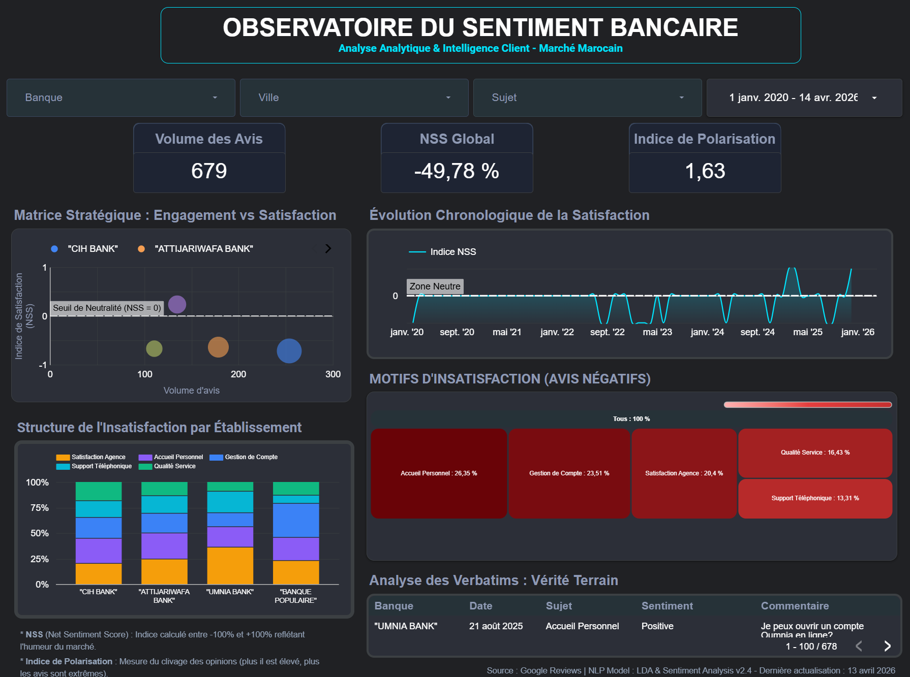
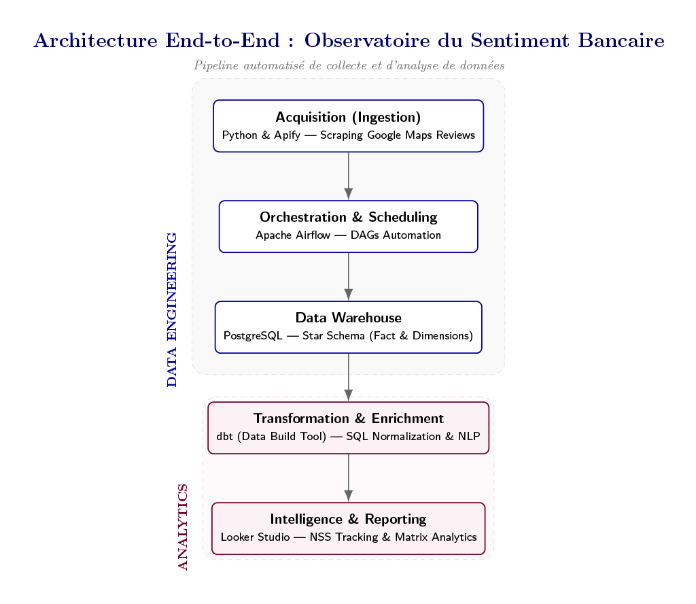
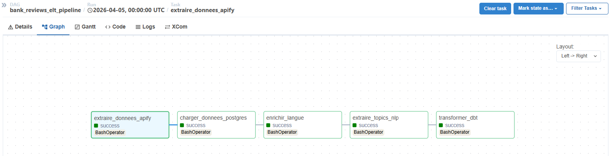
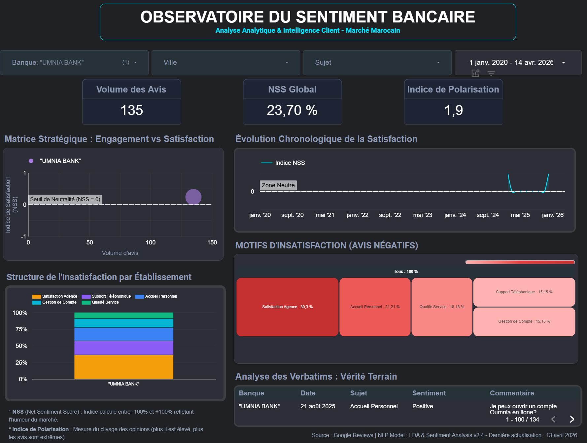

# 🏦 Moroccan Bank Reviews - Data Warehouse & NLP Pipeline

**Project Title:**
*"Analyzing Customer Reviews of Bank Agencies in Morocco using a Modern Data Stack"*

---
## 📊 Executive Dashboard
*A high-level view of the banking sentiment landscape in Morocco (2020-2026).*



---

## 🎯 Objective
Ce projet automatise la **collecte, le traitement et l'analyse** des avis Google Maps pour les banques marocaines. Il transforme des données textuelles non structurées (verbatims clients) en indicateurs fiables de performance et d’expérience client.

Il vise à extraire des **insights actionnables** d'un dataset **multilingue** complexe (Arabe, Français, Anglais, et Darija) via :
* Sentiment Analysis (Net Sentiment Score)
* Topic Modeling (LDA)
* Language Detection

---

## 🏗️ Architecture & Pipeline Workflow
Le projet repose sur une **Modern Data Stack** complète, orchestrée par **Apache Airflow**.



### 🔄 Pipeline Steps (Orchestration)
Le flux de données est automatisé de bout en bout. Voici la vue du DAG dans Airflow :



1.  **Extraction (API Layer)** : Collecte via Apify API (JSON).
2.  **Loading (PostgreSQL)** : Ingestion brute pour préserver l'intégrité.
3.  **Transformation (dbt)** : Nettoyage et modélisation en étoile (Star Schema).
4.  **NLP Enrichment (Python)** : Détection de langue, LDA (Thématiques) et Sentiment Analysis.

---

## 🛠️ Data Modeling & Engineering
### Transformation avec dbt
Le projet utilise **dbt (Data Build Tool)** pour transformer la donnée brute en tables analytiques (Marts). La structure suit les meilleures pratiques de modularité.


### Focus sur le Code (DAG Airflow)
Voici un aperçu de l'implémentation des tâches via le `BashOperator` :


---

## 📈 Key Insights & Results

### 🏦 Zoom sur un cas notable : Umnia Bank
Seule banque affichant un score nettement positif, témoignant d'une forte adhésion client.



### Indicateurs développés
* **Net Sentiment Score (NSS) :** Mesure la satisfaction nette (de -100 à +100).
* **Indice de polarisation (1,63) :** Mesure le niveau de clivage des avis clients.

### Enseignements majeurs
* **Sentiment global négatif (-49,78%) :** L'insatisfaction est structurelle.
* **Crise opérationnelle :** La Gestion de compte, la Qualité de service et l'Accueil affichent un NSS proche de -65%.
* **Fracture territoriale :** Casablanca (-66,90%) subit une forte pression opérationnelle vs Rabat (-42,17%).

---

## 🛠️ Tech Stack

| Layer           | Tools                         |
| --------------- | ----------------------------- |
| Orchestration   | Apache Airflow                |
| Data Storage    | PostgreSQL                    |
| Transformation  | dbt                           |
| NLP             | Python (Pandas, NLTK, Gensim) |
| Data Collection | Apify API                     |
| Visualization   | Looker Studio                 |

---

## 🚀 Installation & Setup

### 1️⃣ Prerequisites

* WSL2 (Ubuntu)
* Python 3.9+
* PostgreSQL
* Apify API Token

---

### 2️⃣ Clone Repository

```bash
git clone https://github.com/votre-username/bank_reviews_dw.git
cd bank_reviews_dw
```

---

### 3️⃣ Virtual Environment

```bash
python3 -m venv venv_linux
source venv_linux/bin/activate
pip install -r requirements.txt
```

---

### 4️⃣ Environment Variables

Create `.env` file:

```env
DB_HOST=localhost
DB_NAME=bank_reviews_dw
DB_USER=your_user
DB_PASSWORD=your_password
APIFY_API_TOKEN=your_token
```

---

## ▶️ Run the Pipeline

### Create Airflow User

```bash
airflow users create \
  --username admin \
  --firstname Chaimae \
  --lastname Eng \
  --role Admin \
  --email admin@example.com \
  --password admin
```

---

### Start Airflow

Terminal 1:

```bash
airflow webserver -p 8080
```

Terminal 2:

```bash
airflow scheduler
```

---

### Launch

* Open: http://localhost:8080
* Trigger DAG: `bank_reviews_elt_pipeline`

---

## 📊 Key Insights

### 🌍 Multilingual Processing

Handles French, Arabic, and Darija (~82% accuracy)

### 🧠 Automated Insights

* Customer Support
* Staff Behavior
* Account Issues

### ⚡ Scalability

Portable and easy to deploy

---

## 📈 Future Improvements

* BERT for sentiment analysis
* Better Arabic NLP
* Kafka streaming
* Streamlit dashboard

---

## 📂 Project Structure

```bash
bank_reviews_dw/
├── dags/
├── dbt/
├── scripts/
├── data/
├── notebooks/
├── .env
├── requirements.txt
└── README.md
```

---

## 👩‍💻 Author

Chaimae El Yaouti
Data Science Engineering Student

---

## ⭐ Acknowledgments

* Google Maps
* Apify
* Open-source NLP libraries
